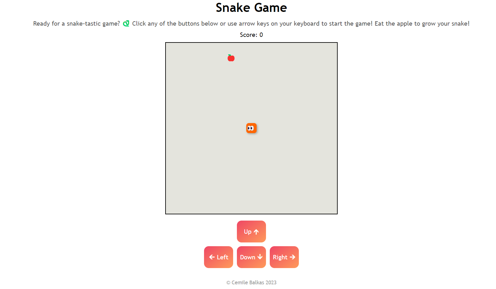
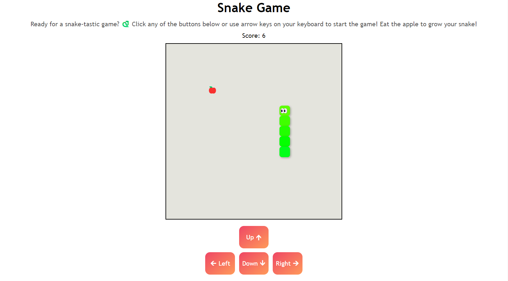

# Snake Game

## Description

This modernized version of the traditional snake game was created to practice the integration of HTML, CSS, and JavaScript in building a simple interactive game. The goal was to incorporate interactivity with JavaScript and styling with CSS to achieve an appealing look.

## Installation

Getting started with the game is easy. Simply use the arrow keys on your keyboard or the on-screen buttons to control the snake. Earn points for each apple the snake consumes, and be mindful of the snake's speed as it grows longer!

## Usage

The images below showcase the appearance of the game:

Here's a snapshot during gameplay:

## Credits

- The game's logic was inspired by the YouTube channel [Web Dev Simplified](https://www.youtube.com/watch?v=QTcIXok9wNY).
- The game's design was inspired from [Replit's tutorial on making a Snake Game with vanilla JavaScript](https://docs.replit.com/tutorials/html-css-js/make-snake-game-vanilla-javascript).
- Some code snippets were adapted from [CSS Scan](https://getcssscan.com/css-buttons-examples).

## Deployment

The deployed website is accessible [here](https://cemileblks.github.io/snake-game/).

## License

This project is licensed under the MIT License. Please refer to the [LICENSE](LICENSE) file in the repository.
